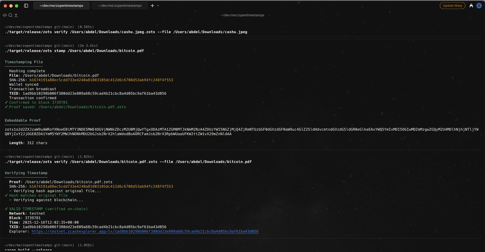
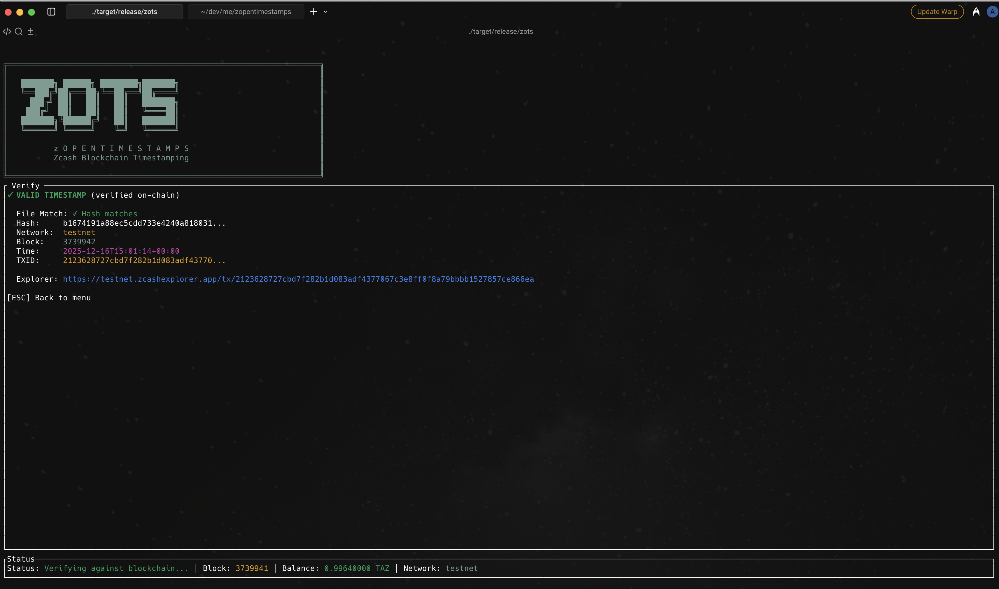
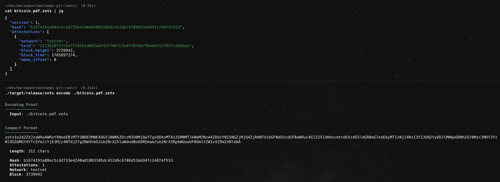
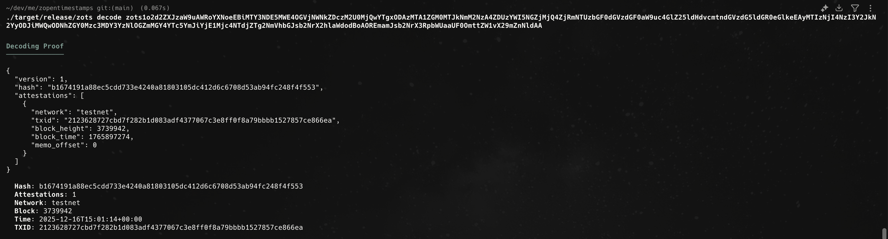
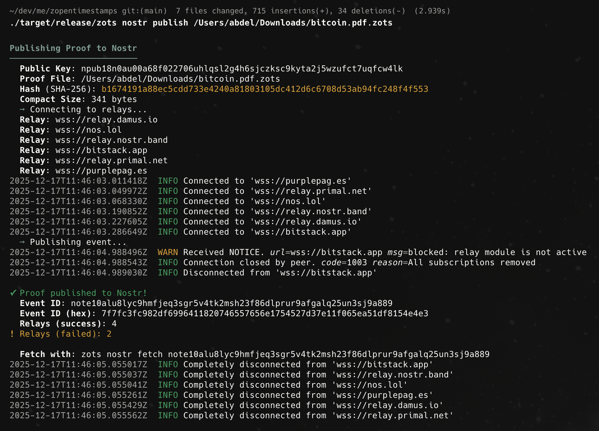
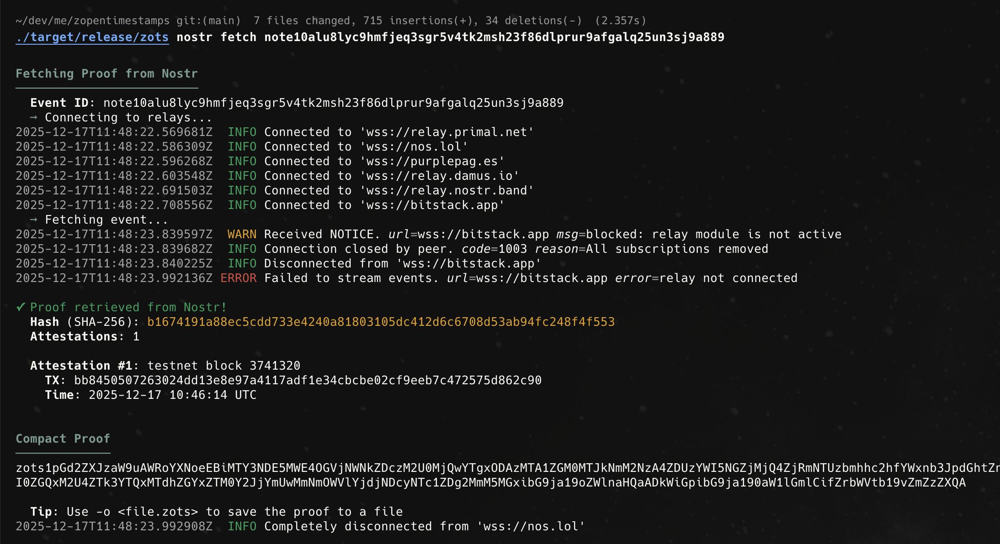
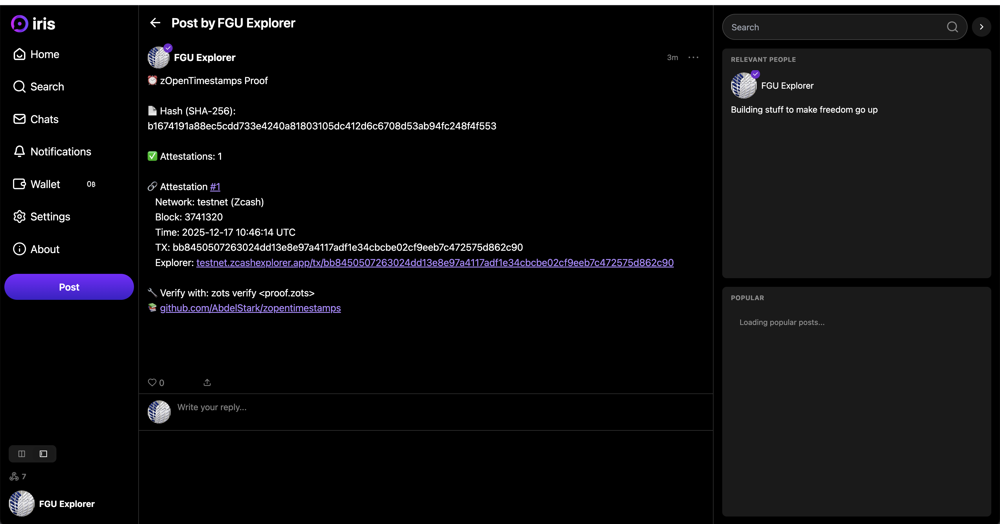

# zOpenTimestamps

A Zcash blockchain timestamping tool inspired by [OpenTimestamps](https://opentimestamps.org/).

Timestamp any file or hash on the Zcash blockchain to create cryptographic proof that data existed at a specific point in time. Features privacy-preserving shielded transactions and embeddable proof format.

> **Warning**
> This is experimental software. **Do not use on mainnet with real funds.**
> The code has not been audited. Use only on testnet for development and testing.

| CLI verification view | Interactive TUI verification |
| --- | --- |
|  |  |

[Bitcoin Whitepaper PDF](https://bitcoin.org/bitcoin.pdf) timestamped on the Zcash testnet blockchain.

| Compact proof encoding | Compact proof decoding |
| --- | --- |
|  |  |

## Table of Contents

- [Features](#features)
- [Security Notice](#security-notice)
- [Installation](#installation)
- [Quick Start](#quick-start)
- [Configuration](#configuration)
- [Usage](#usage)
  - [Nostr Integration](#nostr-integration)
- [Proof Formats](#proof-formats)
- [How It Works](#how-it-works)
- [Architecture](#architecture)
- [Development](#development)
- [Contributing](#contributing)
- [License](#license)
- [Acknowledgments](#acknowledgments)

## Features

- **Timestamp files or hashes** - Create blockchain-anchored timestamps for any data
- **Configurable hashing** - Default SHA-256 with optional BLAKE3 digests tracked in proofs
- **On-chain verification** - Verify timestamps directly against the Zcash blockchain
- **Shielded transactions** - Privacy-preserving using Orchard/Sapling protocols
- **Embeddable proofs** - Compact CBOR+Base64 format for photos, screenshots, git commits
- **Human-readable format** - JSON proof files for transparency and interoperability
- **Nostr integration** - Publish and share proofs via the Nostr protocol

## Installation

### Build from Source

```bash
# Clone the repository
git clone https://github.com/AbdelStark/zopentimestamps
cd zopentimestamps

# Build release binary
cargo build --release

# Binary location: target/release/zots
```

### Verify Installation

```bash
./target/release/zots --version
./target/release/zots --help
```

## Quick Start

### 1. Configure Environment

Create a `.env` file or set environment variables:

```bash
# Required: 24-word BIP-39 seed phrase
# Generate one at: https://iancoleman.io/bip39/
export ZOTS_SEED="your twenty four word seed phrase here ..."

# Optional (defaults shown)
export ZOTS_BIRTHDAY_HEIGHT=3717528        # Wallet birthday for faster sync
export ZOTS_LIGHTWALLETD="https://testnet.zec.rocks:443"
export ZOTS_NETWORK=testnet                 # IMPORTANT: Keep as testnet!
export ZOTS_DATA_DIR=~/.zopentimestamps
```

### 2. Get Testnet Funds

```bash
# Show your receiving address
zots wallet address

# Get testnet ZEC from faucet:
# https://faucet.zecpages.com/
```

### 3. Sync and Check Balance

```bash
zots wallet sync
zots wallet balance
```

### 4. Create Your First Timestamp

```bash
# Timestamp a file
zots stamp document.pdf

# View the proof
zots info document.pdf.zots
```

## Configuration

Environment is read from a `.env` file or the current shell. Defaults are safe for testnet use.

| Variable | Required | Default | Purpose |
|----------|----------|---------|---------|
| `ZOTS_SEED` | Yes | - | 24-word BIP-39 seed phrase |
| `ZOTS_BIRTHDAY_HEIGHT` | No | `3717528` | Wallet birthday to speed up sync |
| `ZOTS_LIGHTWALLETD` | No | `https://testnet.zec.rocks:443` | lightwalletd endpoint |
| `ZOTS_NETWORK` | No | `testnet` | `testnet` only; mainnet intentionally discouraged |
| `ZOTS_DATA_DIR` | No | `~/.zopentimestamps` | Wallet DB and proving parameter cache |

### Nostr Configuration (Optional)

For sharing proofs via the Nostr protocol:

| Variable | Required | Default | Purpose |
|----------|----------|---------|---------|
| `ZOTS_NOSTR_NSEC` | For Nostr | - | Your Nostr secret key (`nsec1...` or hex) |
| `ZOTS_NOSTR_RELAYS` | For Nostr | - | Comma-separated relay URLs |

Example `.env` configuration for Nostr:

```bash
ZOTS_NOSTR_NSEC="nsec1..."
ZOTS_NOSTR_RELAYS="wss://relay.damus.io,wss://nos.lol,wss://relay.nostr.band"
```

Operational notes:

- Verification requires the viewing keys of the wallet that created the timestamp (the memo is encrypted to your own address). Use the same seed when verifying, or export viewing keys to a watcher wallet.
- To reset a stuck wallet, delete the DB at `${ZOTS_DATA_DIR}/wallet.db` and lower `ZOTS_BIRTHDAY_HEIGHT` before re-running commands.
- The CLI and TUI share the same configuration; make sure environment variables are set before launching either.

## Usage

### Timestamp a File

```bash
# Basic usage (creates <filename>.zots)
zots stamp document.pdf

# Custom output path
zots stamp document.pdf -o my-proof.zots

# Use BLAKE3 instead of SHA-256
zots stamp --hash-algorithm blake3 document.pdf

# Enable verbose logging
zots stamp --log-level debug document.pdf

# Don't wait for confirmation (creates pending proof)
zots stamp document.pdf --no-wait
```

### Timestamp a Hash

```bash
# Hash digest (64 hex characters)
zots stamp --hash e3b0c44298fc1c149afbf4c8996fb92427ae41e4649b934ca495991b7852b855

# Git commit SHA-1 (40 hex characters, re-hashed with selected algorithm)
zots stamp --hash abc123def456789...

# Use BLAKE3 for either input style
zots stamp --hash-algorithm blake3 --hash abc123def456789...
```

### Verify a Timestamp

```bash
# Verify proof against blockchain
zots verify document.pdf.zots

# Also verify file hash matches
zots verify document.pdf.zots -f document.pdf

# Verbose verification logs
zots verify --log-level debug document.pdf.zots
```

Verification decrypts the memo using your wallet's viewing keys. Use the same
seed that created the timestamp (or export viewing keys to a watcher) or the
memo cannot be inspected.

### View Proof Information

```bash
zots info document.pdf.zots
```

### Convert Proof Formats

```bash
# Encode to compact format (for embedding)
zots encode document.pdf.zots

# Decode compact format to JSON
zots decode "zots1o2d2ZXJzaW9u..."

# Save decoded proof to file
zots decode "zots1o2d2ZXJzaW9u..." -o proof.zots
```

### Wallet Commands

```bash
zots wallet sync      # Sync with blockchain
zots wallet balance   # Show balance breakdown
zots wallet address   # Show receiving address
zots wallet info      # Show all wallet information
```

### Interactive TUI

```bash
zots tui
```

**Controls:**
- `S` - Stamp screen
- `V` - Verify screen
- `W` - Wallet screen
- `Q` / `Esc` - Quit/Back

### Nostr Integration

Share timestamp proofs via the decentralized Nostr protocol. Proofs are published with human-readable descriptions and machine-parseable compact format.

| Publishing proof to Nostr | Fetching proof from Nostr |
| --- | --- |
|  |  |

| Proof viewed in Nostr client (Iris) |
| --- |
|  |

```bash
# Publish a proof to Nostr relays
zots nostr publish document.pdf.zots

# Fetch a proof from Nostr by event ID
zots nostr fetch note1abc123...

# Fetch and save to file
zots nostr fetch note1abc123... -o proof.zots
```

**Event Format:**

When published, proofs are stored as Nostr events containing:
- Human-readable description with hash, attestations, block info, and explorer links
- `zots-proof` tag with the compact CBOR+Base64 proof (`zots1...`)
- `zots-hash` tag for discoverability by hash

### Logging

- Default log level is `info`
- Use `--log-level debug` on any command for detailed progress (memo creation, transaction build, RPC calls)

## Proof Formats

### JSON Format (.zots files)

Human-readable JSON for transparency and easy inspection:

```json
{
  "version": 1,
  "hash_algorithm": "sha256",
  "hash": "e3b0c44298fc1c149afbf4c8996fb92427ae41e4649b934ca495991b7852b855",
  "attestations": [
    {
      "network": "testnet",
      "txid": "abc123...",
      "block_height": 3739654,
      "block_time": 1734293400,
      "memo_offset": 0
    }
  ]
}
```

**Fields:**
| Field | Description |
|-------|-------------|
| `version` | Proof format version (currently 1) |
| `hash_algorithm` | Hash function (`sha256` default, `blake3` optional) |
| `hash` | Hash digest of timestamped data (hex) |
| `attestations` | List of blockchain attestations |
| `attestations[].network` | "mainnet" or "testnet" |
| `attestations[].txid` | Transaction ID (hex, display order) |
| `attestations[].block_height` | Confirmation block number |
| `attestations[].block_time` | Block Unix timestamp |
| `attestations[].memo_offset` | Memo field offset (usually 0) |

### Compact Format (Embeddable)

For embedding timestamps in files, metadata, or QR codes:

```
zots1o2d2ZXJzaW9uAWRoYXNoeEBhYmNkZWYxMjM0NTY3ODkw...
```

**Structure:**
- Prefix: `zots1` (version identifier)
- Payload: CBOR-encoded proof, Base64url-encoded (no padding)

**Use Cases:**
- **Screenshots**: Embed in EXIF/XMP metadata
- **Photos**: Store in image metadata fields
- **Git commits**: Include as commit message trailer
- **Documents**: Embed in PDF/Office metadata
- **QR codes**: Compact enough for QR encoding

**Example git commit:**
```
feat: implement new feature

Timestamp: zots1o2d2ZXJzaW9uAWRoYXNoeEBhYmNkZWYxMjM0NTY3ODkw...
```

## How It Works

```
┌─────────────┐    ┌─────────────┐    ┌─────────────┐    ┌─────────────┐
│   1. Hash   │───▶│   2. Memo   │───▶│ 3. Broadcast│───▶│  4. Confirm │
│             │    │             │    │             │    │             │
│ Hash of     │    │ Encode hash │    │ Self-send   │    │ Block time  │
│ your file   │    │ in tx memo  │    │ shielded tx │    │ = timestamp │
└─────────────┘    └─────────────┘    └─────────────┘    └─────────────┘
                                                                │
                                                                ▼
                                                         ┌─────────────┐
                                                         │  5. Proof   │
                                                         │             │
                                                         │ .zots file  │
                                                         │ with txid   │
                                                         └─────────────┘
```

1. **Hash**: Your file is hashed (SHA-256 by default, optional BLAKE3)
2. **Memo**: The hash is encoded in a Zcash shielded transaction memo field
3. **Broadcast**: A self-send transaction preserves your privacy while anchoring the hash
4. **Confirm**: Once mined, the block timestamp provides cryptographic proof of time
5. **Proof**: A `.zots` proof file stores the attestation for later verification

### Verification

During verification, zots:
1. Loads the proof file
2. Fetches the transaction from the blockchain
3. Decrypts the memo field using viewing keys
4. Verifies the memo contains the expected hash
5. Returns the block timestamp as proof of existence

## Architecture

```
zopentimestamps/
├── Cargo.toml              # Workspace configuration
├── LICENSE                 # MIT License
├── README.md               # This file
├── crates/
│   ├── zots-core/          # Core library
│   │   ├── src/
│   │   │   ├── lib.rs      # Public API
│   │   │   ├── hash.rs     # Hashing utilities (SHA-256/BLAKE3)
│   │   │   ├── proof.rs    # Proof types and serialization
│   │   │   └── error.rs    # Error types
│   │   └── Cargo.toml
│   │
│   ├── zots-zcash/         # Zcash integration
│   │   ├── src/
│   │   │   ├── lib.rs      # Public API
│   │   │   ├── wallet.rs   # Wallet operations
│   │   │   ├── config.rs   # Configuration
│   │   │   └── memo.rs     # Memo encoding
│   │   └── Cargo.toml
│   │
│   └── zots-cli/           # CLI application
│       ├── src/
│       │   ├── main.rs     # Entry point
│       │   ├── cli.rs      # Argument parsing
│       │   ├── commands/   # Command implementations
│       │   ├── output.rs   # Terminal output helpers
│       │   └── tui/        # Terminal UI
│       └── Cargo.toml
│
└── docs/                   # Additional documentation
```

### Crate Responsibilities

| Crate | Purpose |
|-------|---------|
| `zots-core` | Hash functions, proof format, serialization |
| `zots-zcash` | Wallet, transactions, lightwalletd integration |
| `zots-cli` | CLI commands, TUI, user interaction |

## License

This project is licensed under the MIT License - see the [LICENSE](LICENSE) file for details.


## Security Notice

> **This software is provided for educational and experimental purposes only.**

- **NOT AUDITED**: This code has not undergone security audits
- **TESTNET ONLY**: Do not use on mainnet with real ZEC
- **EXPERIMENTAL**: APIs and formats may change without notice
- **NO WARRANTY**: See [LICENSE](LICENSE) for full terms

## Acknowledgments

- [OpenTimestamps](https://opentimestamps.org/) - Original Bitcoin timestamping protocol
- [Zcash](https://z.cash/) - Privacy-focused cryptocurrency
- [librustzcash](https://github.com/zcash/librustzcash) - Zcash Rust libraries
- [Zooko](https://x.com/zooko/status/1998440166244102664?s=46) - For the vision of embedded timestamp proofs on Zcash (see this [X post](https://x.com/zooko/status/1998440166244102664?s=46))

---

**Disclaimer**: This software is experimental and provided "as is" without warranty. Do not use with real funds. Always verify proofs independently before relying on them for any purpose.
